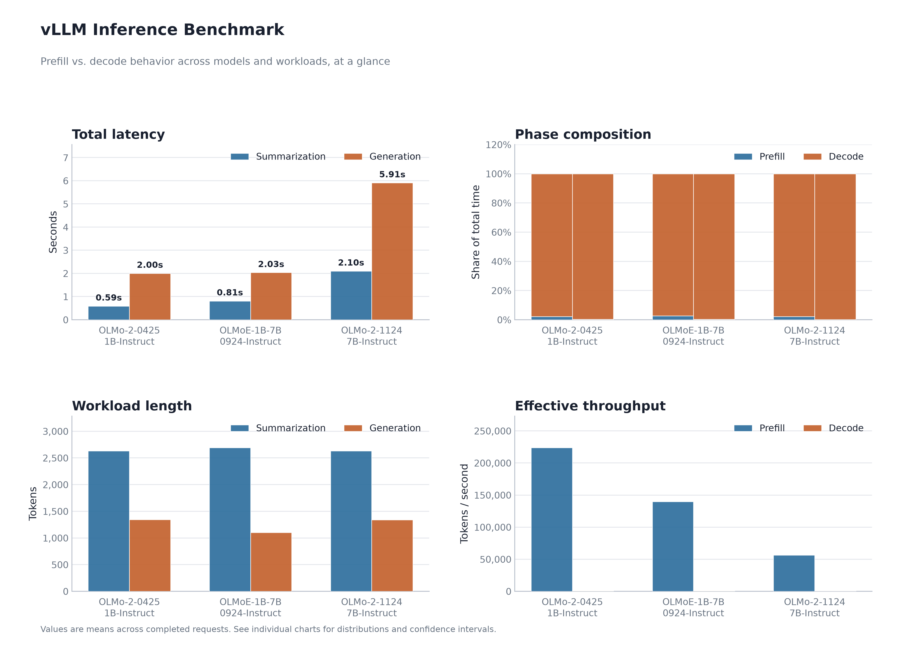
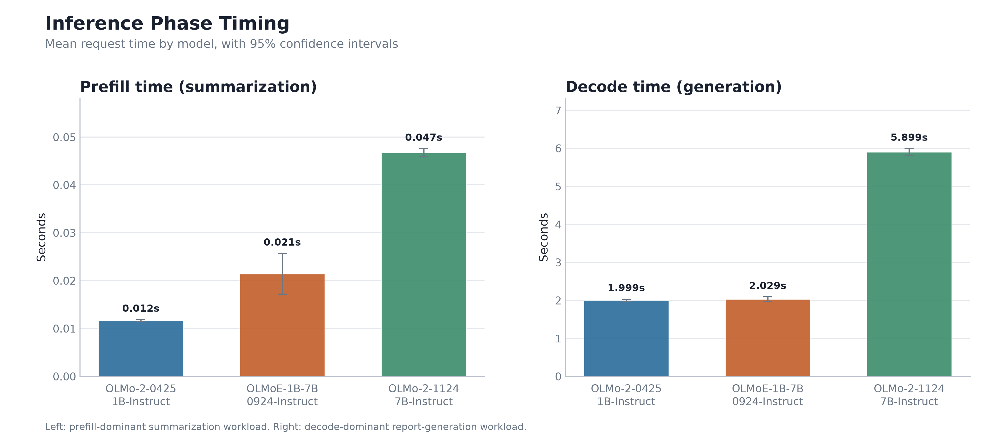
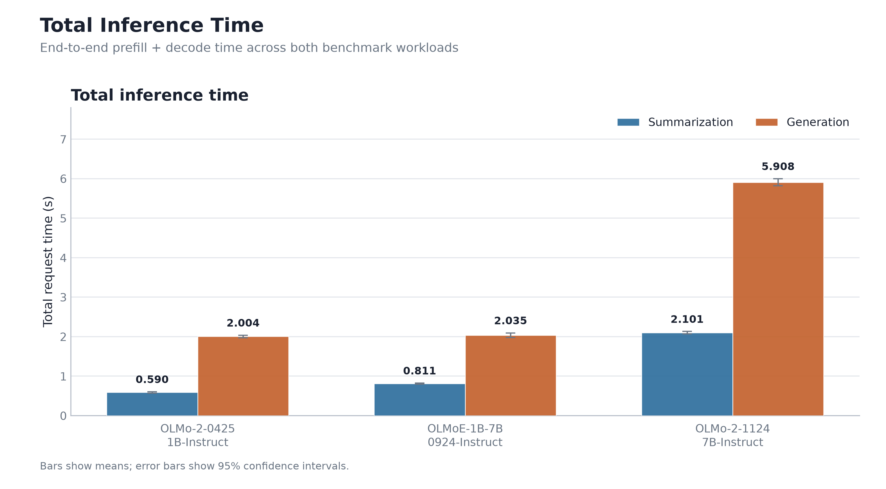
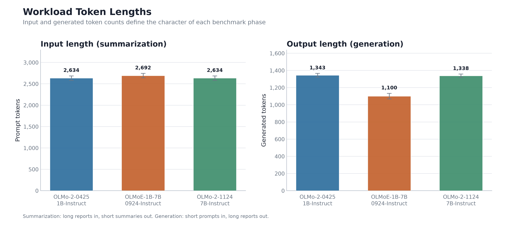
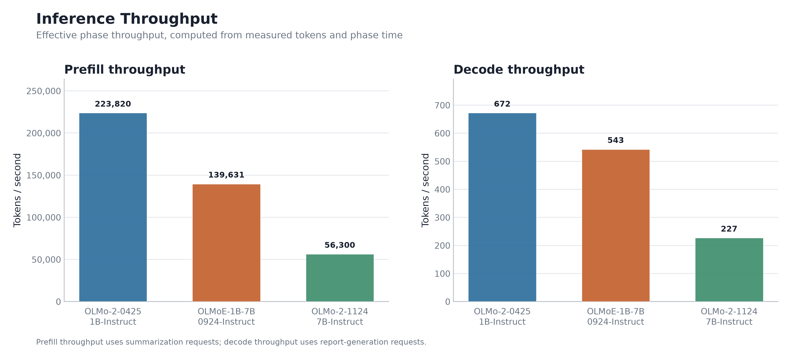
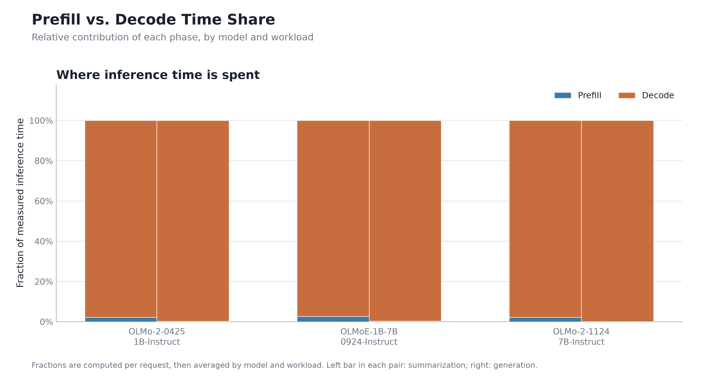
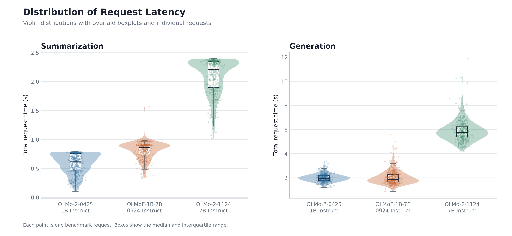
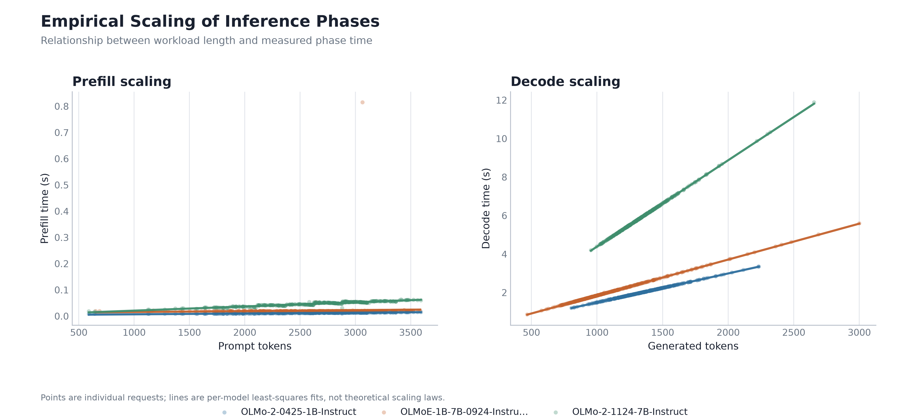
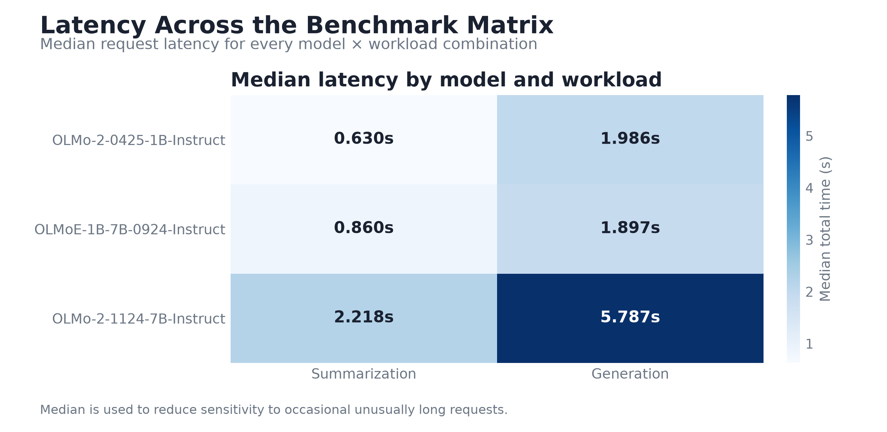
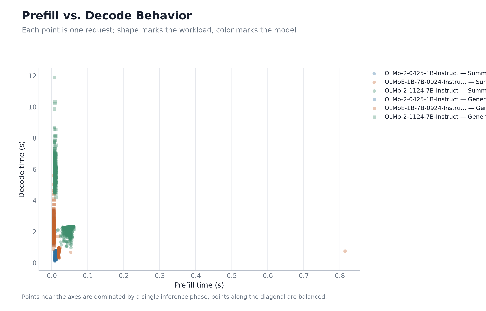

# vLLM FP8 Inference Benchmark

Empirical investigation of **Dense vs. Mixture-of-Experts (MoE) serving** using vLLM, focusing on the performance of **prefill-dominated** and **decode-dominated** workloads.

This work was completed as a homework assignment for **CS 601.768: Language Model Agents**, a graduate-level course taught by **Benjamin Van Durme** at Johns Hopkins University during **Fall 2026**.

## Overview

The goal of this assignment is to investigate **when a Mixture-of-Experts model provides a serving-throughput advantage over dense models**.

I compare three language models with different architectures and parameter counts:

| Model | Architecture | Parameters | Role |
| ----------------------------------- | ------------------------ | ---------------------: | -------------------- |
| `allenai/OLMo-2-0425-1B-Instruct` | Dense | ~1B | Small dense baseline |
| `allenai/OLMoE-1B-7B-0924-Instruct` | Mixture-of-Experts (MoE) | ~1B active / ~7B total | MoE model |
| `allenai/OLMo-2-1124-7B` | Dense | ~7B | Large dense baseline |

The three models provide comparisons across both **model size** and **active parameter count**. In particular, the MoE model has approximately 1B active parameters while containing approximately 7B total parameters, allowing its serving behavior to be compared with both the 1B dense and 7B dense models.

All three models are served using **vLLM on a single GPU**, with **FP8 weights and an FP8 KV cache**. The serving configuration is kept as comparable as possible across models.

---

## Prefill and Decode Workloads

The assignment calls for separate characterization of **prefill-dominated** and **decode-dominated** workloads.

I construct these two workloads using the **GovReport** dataset.

### Prefill-Dominated Workload

For the prefill experiment, the model receives a long GovReport document and produces a relatively short summary.

```text
Long GovReport document

        │

        │ Many input tokens

        ▼

     PREFILL

        │

        ▼

   Short summary
```

The experiment varies the **length of the input context** and measures average throughput.

The resulting plot uses:

* **X-axis:** Input context length
* **Y-axis:** Average tokens/second

This workload is designed to emphasize the cost of processing the input context during the prefill phase.

### Decode-Dominated Workload

For the decode experiment, the model receives a relatively short GovReport summary and generates a detailed, government-style report.

```text
Short GovReport summary

        │

        │ Relatively few input tokens

        ▼

     PREFILL

        │

        │ Long generation

        ▼

Detailed government-style report
```

The experiment varies the **number of parallel generations** and measures aggregate throughput.

The resulting plot uses:

* **X-axis:** Number of parallel generations
* **Y-axis:** Average tokens/second

This workload is designed to emphasize the decode phase and examine how throughput changes with concurrent generation.

---

## Dataset

The experiments use the **GovReport** dataset, a long-document summarization dataset containing reports from the **U.S. Government Accountability Office (GAO)** and **Congressional Research Service (CRS)**.

GovReport provides long government reports and corresponding summaries, making it suitable for constructing the two workloads.

### Context Length

The models are evaluated within a **4,096-token context window**.

I select GovReport samples that can fit within this constraint while leaving sufficient space for generation. Thus, the relevant constraint for each request is:

```text
input tokens + output tokens ≤ 4096
```

The input lengths reported in the experiments are therefore **token lengths**, rather than word counts.

---

## Experimental Setup

The three models are served using **vLLM on a single GPU**.

The serving configuration is kept as consistent as possible across models.

### Precision

* **FP8 weights**
* **FP8 KV cache**

### Hardware

* **Single GPU**

### Inference Engine

* **vLLM**

---

## Measurements

The benchmark collects raw measurements for each inference request, including:

* Input/prompt token count
* Completion/output token count
* Prefill time
* Decode time
* Total inference time
* Throughput

Prefill and decode timing are obtained from vLLM's exposed metrics.

The raw measurements are retained alongside the final results so that the reported throughput can be inspected at the individual-request level.

---

## Results

The benchmark produces a set of visualizations covering overall performance, inference-phase timing, throughput, workload characteristics, latency distributions, scaling behavior, and the relationship between prefill and decode.

### Benchmark Dashboard

The dashboard provides a compact overview of the main benchmark measurements across the three models and both workloads.



### Phase Timing

Mean prefill and decode latency are shown separately for the two workloads, with 95% confidence intervals.



### Total Inference Time

End-to-end request latency combines both prefill and decode time for each workload.



### Workload Token Lengths

The benchmark workloads differ in their input and generated token lengths, reflecting their prefill- and decode-dominated designs.



### Throughput

Effective prefill and decode throughput is computed from the measured token counts and corresponding phase times.



### Prefill vs. Decode Time Share

This visualization shows the relative contribution of prefill and decode to total measured inference time for each model and workload.



### Latency Distributions

The latency distributions show individual request measurements alongside violin distributions and boxplots, giving a view of both central tendency and request-level variability.



### Scaling Relationships

These plots examine how measured prefill time changes with prompt length and how measured decode time changes with the number of generated tokens. Lines show per-model least-squares fits.



### Latency Matrix

The latency matrix summarizes median total request latency for every model × workload combination.



### Prefill vs. Decode Behavior

Each point represents an individual request, showing the relationship between its measured prefill and decode times. Marker shape distinguishes the workload and color distinguishes the model.




---

## Interpretation

The results are used to examine how the MoE model behaves relative to the two dense baselines.

In particular, the comparison considers:

* **Model size**
* **Number of active parameters**
* **Sequence length**
* **Concurrent decoding**
* **Dense vs. MoE architecture**

The results are interpreted in terms of when the MoE model behaves more similarly to the **small dense model** and when it behaves more similarly to the **large dense model**.

The **OLMoE technical report** is also used as additional context when interpreting the observed performance characteristics of the MoE model.

---

## Implementation

The benchmark is implemented in:

```text
run_vllm.py
```

The script handles inference requests, collects vLLM prefill/decode timing metrics, records token usage, and saves the raw measurements and generated outputs.

Prompt construction for the two workloads is defined in:

```text
prompts.py
```

---

## Repository Structure

```text
.

├── README.md
├── run_vllm.py
├── prompts.py
└── results/
    └── visualizations/
        ├── 00_benchmark_dashboard.png
        ├── 01_phase_timing.png
        ├── 02_total_time.png
        ├── 03_token_lengths.png
        ├── 04_throughput.png
        ├── 05_phase_balance.png
        ├── 06_latency_distributions.png
        ├── 07_scaling_relationships.png
        ├── 08_latency_matrix.png
        └── 09_prefill_vs_decode.png
```

---

## Course

**CS 601.768: Language Model Agents**

Johns Hopkins University

Fall 2026

Instructor: **Benjamin Van Durme**
